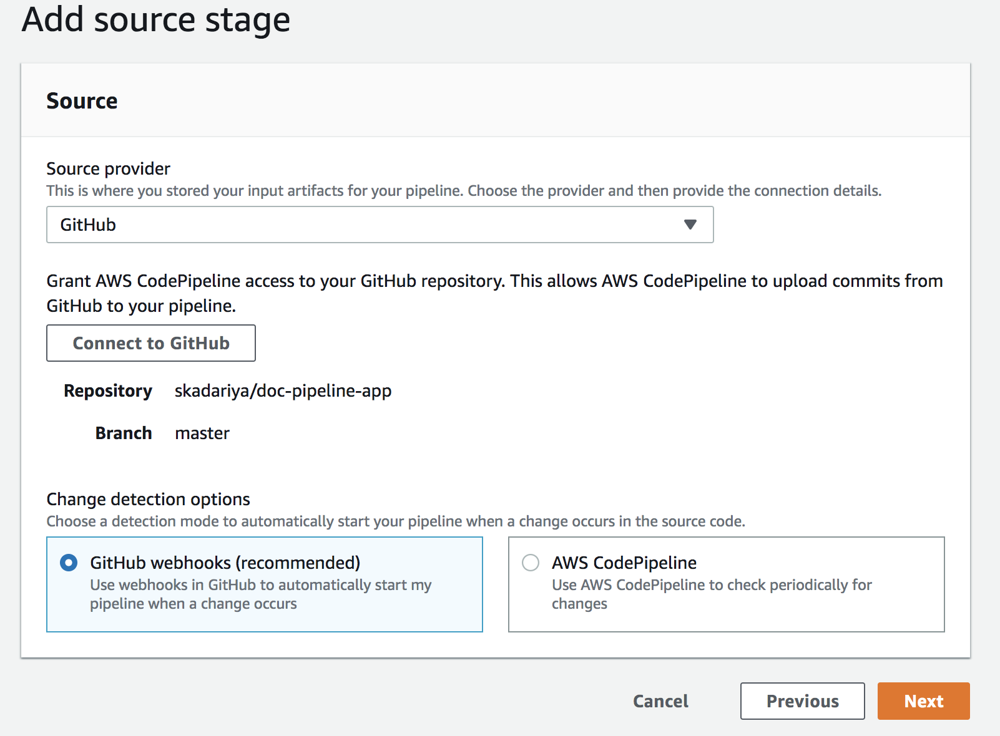
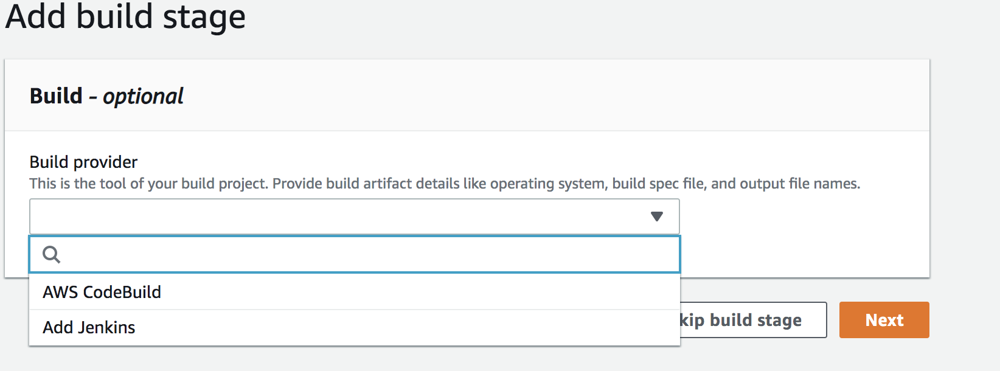

# doc-pipeline-app
Implement a working pipe line fro a C# application

## Instruction

> Step A: If local machine doesn't have "donet" run the " brew cask install dotnet" in the terminal. 

> Step B: Then goto "https://dotnet.microsoft.com/download" and download dotnet core. 


> Step1: Clone the provided C# application repo. 

> Step2: If the clone repo is missing  "aws-windows-deployment-manifest.json" and "buildspec.yml" add following files:

> touch aws-windows-deployment-manifest.json and add the following code:

```
{
    "manifestVersion": 1,
    "deployments": {
        "aspNetCoreWeb": [{
                "name": "_Name-of-EB-Application_",
                "parameters": {
                    "appBundle": "./site",
                    "iisPath": "/",
                    "iisWebSite": "Default Web Site"
                }
            }
        ]
    }
}

> touch a buildspec.yml and add the following code:

```version: 0.2

phases:

build:
commands:
  - dotnet restore YOURAPPFOLDER/YOURAPPNAME.csproj
  - dotnet build YOURAPPFOLDER/YOURAPPNAME.csproj
  - dotnet publish YOURAPPFOLDER/YOURAPPNAME.csproj -o site
 artifacts:
  files:
    - YOURAPPFOLDER/site/**/*
    - YOURAPPFOLDER/aws-windows-deployment-manifest.json
```

> Step4: Go to you AWS console and go to Elastic beans (EB) console

> Step5: Click create a new EB 


> Step6: Select on environment tier and select " Web server enviroment"


> Step7: Fill the Environment information and  select ".Net" for platform


> Step8: Click create and wait untill the process is completes. It will take about 3-5 minutes. 


> Step9: To go the CodePipeline console

> Step10: Click on "Create Pipeline"

> Step 11: Fill the proper pipeline settings . Input the Pipeline name and leave rest to default.

> Step 12: Add source to connect to your proper github repo


> Step 13: Skip the add build portion


> Step 13: To add build, select AWS code build option


> 13.	Build <br>
  a.	Build provider – AWS Codebuild<br>
  b.	Region – default <br>
  c.	Project – Click create project <br>
  &nbsp;&nbsp;&nbsp;&nbsp;&nbsp;&nbsp;i.	Under Create a build Project <br>
  	&nbsp;&nbsp;&nbsp;&nbsp;&nbsp;&nbsp;&nbsp;&nbsp;&nbsp;&nbsp;&nbsp;&nbsp;Enter Project Name <br>
      &nbsp;&nbsp;&nbsp;&nbsp;&nbsp;&nbsp;&nbsp;&nbsp;&nbsp;&nbsp;&nbsp;&nbsp;Select managed image <br>
  	&nbsp;&nbsp;&nbsp;&nbsp;&nbsp;&nbsp;&nbsp;&nbsp;&nbsp;&nbsp;&nbsp;&nbsp;Select Operating system <br>
  	&nbsp;&nbsp;&nbsp;&nbsp;&nbsp;&nbsp;&nbsp;&nbsp;&nbsp;&nbsp;&nbsp;&nbsp;Runtime – Standard <br>
  	&nbsp;&nbsp;&nbsp;&nbsp;&nbsp;&nbsp;&nbsp;&nbsp;&nbsp;&nbsp;&nbsp;&nbsp;Image – Select Standard 2.0 <br>
  	&nbsp;&nbsp;&nbsp;&nbsp;&nbsp;&nbsp;&nbsp;&nbsp;&nbsp;&nbsp;&nbsp;&nbsp;Image version – Select Always use the latest image for this runtime version <br>
  	&nbsp;&nbsp;&nbsp;&nbsp;&nbsp;&nbsp;&nbsp;&nbsp;&nbsp;&nbsp;&nbsp;&nbsp;Select new service role <br>
  	&nbsp;&nbsp;&nbsp;&nbsp;&nbsp;&nbsp;&nbsp;&nbsp;&nbsp;&nbsp;&nbsp;&nbsp;Buildspec - insert build command - `dotnet test && dotnet build` <br>
  	&nbsp;&nbsp;&nbsp;&nbsp;&nbsp;&nbsp;&nbsp;&nbsp;&nbsp;&nbsp;&nbsp;&nbsp;Click continue to code pipeline <br>

> Step 14: Add deploy information


> Click creat to create the pipeline

## Deployed Link 
> [Deployed Link](http://cshrappipeline.us-west-2.elasticbeanstalk.com/)

## Trouble Shoot:
> Upload the ".yml' file to EB

> Make sure '/basic-web-app/site/' contains the web.config file

> contains of 'web.config' file:
```
version: 0.2

phases:
  build:
    commands:
      - dotnet restore basic-web-app/basic-web-app.csproj
      - dotnet build basic-web-app/basic-web-app.csproj
      - dotnet publish basic-web-app/basic-web-app.csproj -o site
artifacts:
  files:
    - deployment-app-csharp/basic-web-app/site/**/*
    - deployment-app-csharp/basic-web-app/aws-windows-deployment-manifest.json
```

# Simple C# Web Server

## Startup Steps
- Open a terminal and change to the folder containing the project. Specifically, where the `.sln` file is

## Build the app
- `dotnet build`

## Starting the server
- `dotnet run --project basic-web-app`

## Testing
- Run the tests
  - `dotnet test`
