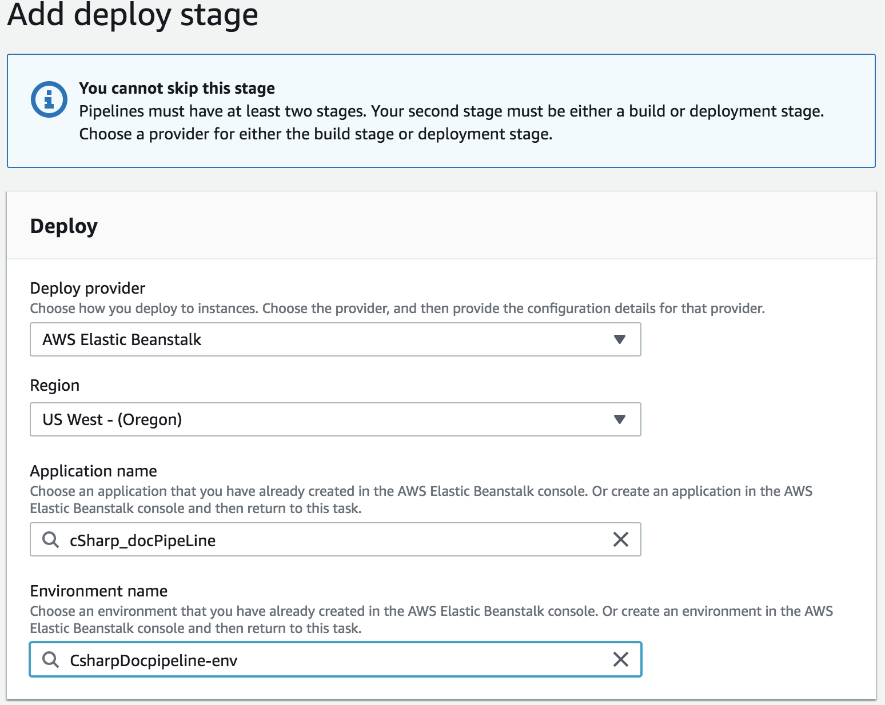

# doc-pipeline-app
Implement a working pipe line fro a C# application

## Instruction

> Step A: If you machine doesn't have "donet" run the " brew cask install dotnet" in the terminal. 

> Step B: Then goto "https://dotnet.microsoft.com/download" and download dotnet core. 


> Step1: Clone the provided C# application repo. 

> Step2: If the clone repo is missing  "aws-windows-deployment-manifest.json" and "buildspec.yml" add following files:

> touch aws-windows-deployment-manifest.json and add the following code:
```
{
    "manifestVersion": 1,
    "deployments": {
        "aspNetCoreWeb": [{
                "name": "YOURAPPNAMEHERE",
                "parameters": {
                    "appBundle": "./site",
                    "iisPath": "/",
                    "iisWebSite": "Default Web Site"
                }
            }
        ]
    }
}

> touch a buildspec.yml and add the following code:

```
version: 0.2

phases:

build:
commands:
  - dotnet restore YOURAPPFOLDER/YOURAPPNAME.csproj
  - dotnet build YOURAPPFOLDER/YOURAPPNAME.csproj
  - dotnet publish YOURAPPFOLDER/YOURAPPNAME.csproj -o site
 artifacts:
  files:
    - YOURAPPFOLDER/site/**/*
    - YOURAPPFOLDER/aws-windows-deployment-manifest.json
```

> Step4: Go to you AWS console and go to Elastic beans (EB) console

> Step5: Click create a new EB 


> Step6: Select on environment tier and select " Web server enviroment"


> Step7: Fill the Environment information and  select ".Net" for platform


> Step8: Click create and wait untill the process is completes. It will take about 3-5 minutes. 


> Step9: To go the CodePipeline console

> Step10: Click on "Create Pipeline"

> Step 11: Fill the proper pipeline settings . Input the Pipeline name and leave rest to default.

> Step 12: Add source to connect to your proper github repo


> Step 13: Skip the add build portion


> Step 14: Add deploy information


> Click creat to create the pipeline


# Simple C# Web Server

## Startup Steps
- Open a terminal and change to the folder containing the project. Specifically, where the `.sln` file is

## Build the app
- `dotnet build`

## Starting the server
- `dotnet run --project basic-web-app`

## Testing
- Run the tests
  - `dotnet test`
